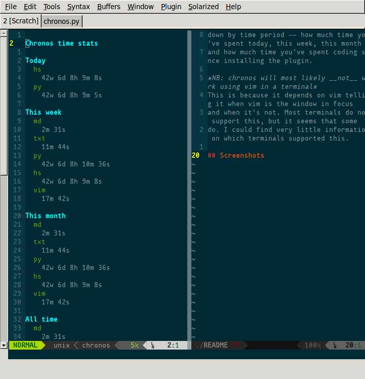

# chronos

## What is chronos?
Chronos is a vim plugin that helps you keep track of how much time you spend
_actually_ looking at vim. Chronos is the name of the God of Time in greek
mythology.. or something like that, anyway.

Chronos works by noticing when you switch between buffers or when vim loses
focus. Only the time you spend looking at vim is recorded. Upon request,
chronos can then serve up a detailed breakdown of how much time you spent
looking at files by their extensions. Additionally, the stats are also broken
down by time period -- how much time you've spent today, this week, this month
and how much time you've spent coding since installing the plugin.

**NB: chronos will most likely _not_ work using vim in a terminal**

This is because it depends on vim telling it when vim is the window in focus
and when it's not. Most terminals do not support this, but it seems that some
do. I could find very little information on which terminals supported this.

**NB: Requires vim compiled with python support.**

To see if you have vim with python support, run `vim --version | grep -i
python` in your terminal and look for `+python`. If it's there, you're good to
go.

## Screenshots


## Installation
I use [Vundle](http://github.com/gmarik/Vundle). For Vundle, simply add ..

```viml
Bundle 'saevarb/chronos'
```

.. to your .vimrc, run `:so $MYVIMRC` in vim followed by `:BundleInstall`, and
you're good to go. If you use another package manager(like NeoBundle) refer to
their documentation. If you do not use a package manager, I can't help you, as
I've never bothered with anything else and you'll have to ask the nice people
in #vim on freenode or on the [vim](www.vim.org) mailing list.

## Usage
chronos is rather simple in usage. For the most part, chronos just sits there,
keeping track of time. But there are a couple of commands.

### Configuration

`let g:ChronosInactivityThreshold = 600`
This is the threshold at which chronos will consider you having gone inactive
with your session open. The default is 600 seconds(10 minutes). This means
that if you are looking at the same vim session for more than 10 minutes at a
time, without ever switching to another buffer or switching focus away from
vim, the that time span will not be added to your statistics as to not skew
them. **Currently, chronos does not warn the user when the threshold has been
crossed. This is the next thing I will implement.**
If you do not like 10 minutes as the threshold, simply copy the line above
into your .vimrc and change it to something else.
If you have been looking at the same vim session for more than your threshold,
and you want to add it to your statistics, use `:ChronosAddAnyway`.

### Commands

`:ChronosShowStats` will open up a scratch buffer with a nice highlighted
breakdown of your statistics like displayed in the screenshot.

`:ChronosClearStats` will let your clear all your statistics if you so wish.
When you run it, chronos will required confirmation that you really want to do
this, which you do by running the command again. **Your statistics cannot be
recovered if you do this, so use at your own peril.**

`:ChronosAddAnyway` If the inactivity threshold has been crossed and you want
to add that time span to your statistics, use this command.

## Contributing? Feature requests? Bugs?
If you want to contribute, there's stuff to do. Take a look at the [todo
file](TODO.md) for a list, or look through chronos.py for TODO comments. Hack
away and submit a pull request. If you find any bugs, and there are most
likely bound to be some, submit an issue in the issue tracker.

## License
[MIT](LICENSE)


